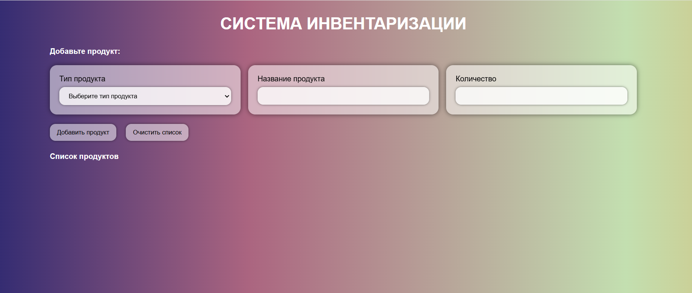

# 🛒 Inventory System

Простая система инвентаризации продуктов, написанная на **HTML, CSS и JavaScript**.
Позволяет добавлять продукты по категориям, указывать их количество, отображать список и очищать его.

## 🚀 Функционал

* Выбор типа продукта (овощи, напитки, сыры и т.д.)
* Ввод названия и количества продукта
* Автоматическое добавление продукта в список
* Группировка продуктов по категориям
* Очистка всего списка одним нажатием
* Проверка на заполнение всех полей и количество больше нуля

## 📂 Структура проекта

```
inventory-system/
│── index.html      # Основная HTML-разметка
│── style.css       # Стили
│── main.js         # Логика работы
```

## 🖼 Интерфейс

* Простая форма для добавления продукта
* Динамически обновляемый список
* Кнопка для очистки

## ⚙️ Установка и запуск

1. Склонируйте репозиторий:

   ```bash
   git clone https://github.com/username/inventory-system.git
   ```
2. Перейдите в папку проекта:

   ```bash
   cd inventory-system
   ```
3. Запустите `index.html` в браузере.

## 💡 Пример использования

* Выберите категорию → "Овощи/Фрукты"
* Введите продукт → "Яблоки"
* Укажите количество → "5"
* Нажмите **Добавить продукт** → В списке появится "Яблоки 5"

## 📸 Скриншоты



## 🔮 План развития

* Добавить удаление отдельных продуктов
* Сохранение списка в `localStorage`
* Более красивый дизайн
